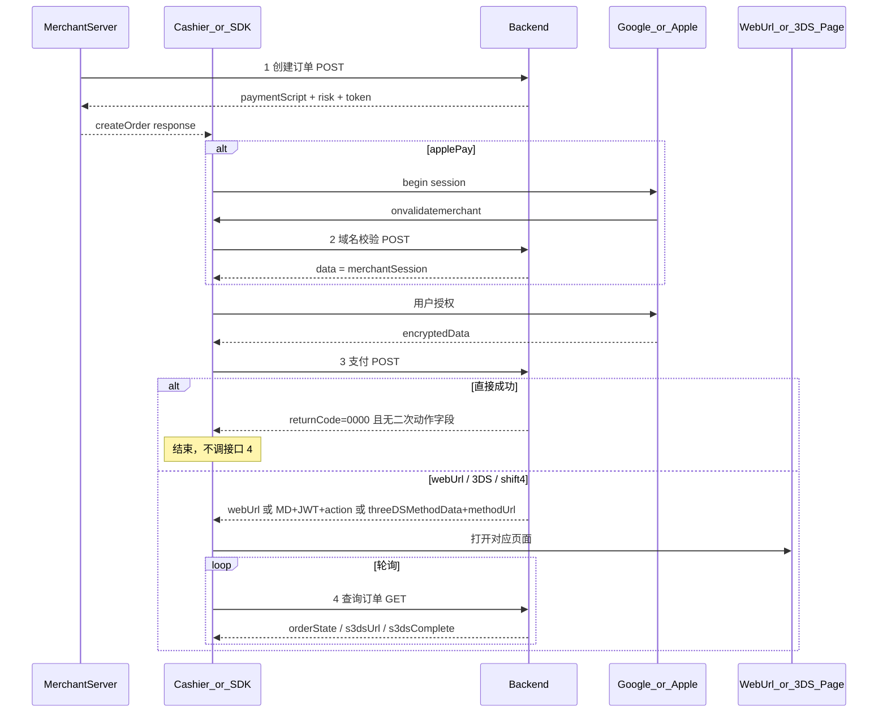

# 钱包支付 API 对接说明

前后端联调契约。类型与报文示例见本目录 TypeScript 文件。

| #   | 文件                                             | 方法     | 类型                                                   | 何时调用                                                  |
| --- | ------------------------------------------------ | -------- | ------------------------------------------------------ | --------------------------------------------------------- |
| —   | [`common.ts`](./common.ts)                       | —        | `ApiResponse` / `BillingAddress`                       | 共用                                                      |
| 0   | [`get-token.ts`](./get-token.ts)                 | **POST** | `GetTokenRequest` → `GetTokenResponse`                 | 换 `accessToken`；**建议商户服务端调用**                  |
| 1   | [`create-order.ts`](./create-order.ts)           | **POST** | `CreateOrderRequest` → `CreateOrderResponse`           | **商户服务端**调用；拿 `paymentScript` / `risk` / `token` |
| 2   | [`validate-merchant.ts`](./validate-merchant.ts) | **POST** | `ValidateMerchantRequest` → `ValidateMerchantResponse` | SDK：仅 Apple Pay，`onvalidatemerchant`                   |
| 3   | [`pay.ts`](./pay.ts)                             | **POST** | `PayRequest` → `PayResponse`                           | SDK：钱包授权后                                           |
| 4   | [`query-order.ts`](./query-order.ts)             | **GET**  | `QueryOrderRequest` → `QueryOrderResponse`             | SDK：**仅**接口 3 未直接成功时                            |

> 创建订单（接口 1）由商户服务端签名调用；响应含 `token`，传入 `RampPay.init({ order })`。  
> SDK 调用接口 2–4 时请求头带 **`payment-hub-token: <token>`**，不签名。仅接口 4 为 GET。  
> 路径见 SDK `src/endpoints.ts`。入口：`import … from './pay-api'`（[`index.ts`](./index.ts)）。

---

## 1. 统一响应壳

四个接口共用；**业务字段一律在 `data` 内**。

```json
{
  "success": true,
  "returnCode": "0000",
  "returnMsg": "SUCCESS",
  "extend": "",
  "data": {},
  "traceId": "68b11d63f919cca7adbb4bbe57939df9"
}
```

| 字段         | 说明                              |
| ------------ | --------------------------------- |
| `returnCode` | `'0000'` 成功；**其他值均为失败** |
| `returnMsg`  | 失败时须向用户/日志吐出           |
| `success`    | 与 `returnCode` 对应的布尔标记    |
| `data`       | 成功时的业务载荷                  |
| `extend`     | 扩展字段，可空串                  |
| `traceId`    | 链路追踪                          |

客户端先判断 `returnCode === '0000'`，再解析 `data`（见 `ApiResponse` / `isApiSuccess`）。

---

## 2. 主流程



### 接口 3 支付结果分支

| 条件                                 | 客户端动作                                                                                                 | 是否轮询接口 4 |
| ------------------------------------ | ---------------------------------------------------------------------------------------------------------- | -------------- |
| `returnCode !== '0000'`              | 失败，吐出 `returnMsg`                                                                                     | **否**         |
| `data` 无二次动作字段                | 成功回调（`onSuccess`，随后 `onComplete`）                                                                 | **否**         |
| 有 `webUrl`                          | `onAction(webUrl)`；App 用 Bridge 抽屉打开；纯浏览器 callback 模式可手动 `sdk.openAction(action)`          | **是**         |
| 有 `MD` + `JWT` + `action`           | `onAction(threeDS)`；App 推荐 Challenge 壳页 Bridge；纯浏览器 callback 模式可手动 `sdk.openAction(action)` | **是**         |
| 有 `threeDSMethodData` + `methodUrl` | `onAction(threeDSMethod)`；App 推荐 Method 壳页 Bridge                                                     | **是**         |

### 接口 4 轮询规则（建议间隔 2s）

1. 有 `s3dsUrl` → SDK 触发 `onAction(s3ds)`；App 用 Bridge 打开，纯浏览器 `actionMode: 'auto'` 时 SDK 会整页导航
2. `orderState === 1` 且 `s3dsComplete !== true` → 继续轮询
3. `orderState` 属于成功态 `{2,5}` → `onSuccess`，随后 `onComplete`
4. `orderState` 属于失败态 `{0,6,7,8,9,10,11}` → `onError`
5. 其它非 pending（如 `3` / `4` `TRANSFER`）或仅 `s3dsComplete === true` → `onComplete`

---

## 3. 接口 1 — 创建订单

**POST** `/open/api/v4/merchant/order/create`

### 请求（对齐 Apifox S2S）

见 `CreateOrderRequest`：必填含 `side`、`merchantOrderNo`、`amount`、`fiatCurrency`、`cryptoCurrency`、`orderType`、`network`、`payWayCode`、`redirectUrl`、`callbackUrl`、`clientIp` 等。钱包：`payWayCode` `501` Apple / `701` Google。

### 响应 `data`

| 字段                  | 说明                                                                                                                                                                                                                        |
| --------------------- | --------------------------------------------------------------------------------------------------------------------------------------------------------------------------------------------------------------------------- |
| `orderNo`             | 订单号，后续接口必带                                                                                                                                                                                                        |
| `paymentScript`       | 钱包原生唤起参数（见下）                                                                                                                                                                                                    |
| `method`              | 可选 `'googlePay'` \| `'applePay'`；可不传，SDK 可推断                                                                                                                                                                      |
| `environment`         | 可选 `'TEST'` \| `'PRODUCTION'`，不传默认 `'PRODUCTION'`；供 Google Pay `PaymentsClient.environment`（也可写在 `paymentScript` 内，SDK 提升到 `order.environment`）。TEST 联调须返回该字段，否则 GP 按 PRODUCTION 建 client |
| `risk`                | 风控开关与可覆盖配置                                                                                                                                                                                                        |
| `validateMerchantUrl` | 仅 Apple Pay，可选；有值则覆盖 SDK 当前环境的接口 2 地址                                                                                                                                                                    |

#### `paymentScript` — Google Pay

`PaymentDataRequest`。`totalPriceLabel`、`merchantId`、`merchantName` **必传**。
SDK 固定使用 `callbackIntents: ['PAYMENT_AUTHORIZATION']`，并注册
`paymentDataCallbacks.onPaymentAuthorized`（创建订单下发的 callbackIntents 会被覆盖）。

令牌化二选一：

- `tokenizationSpecification.type = 'DIRECT'` + `publicKey`
- `type = 'PAYMENT_GATEWAY'` + `gateway` / `gatewayMerchantId`

账单地址需要时带 `billingAddressRequired` + `billingAddressParameters`。

#### `paymentScript` — Apple Pay

创建 `ApplePaySession` 的 PaymentRequest（`countryCode` / `currencyCode` / `total` 等）。  
如需覆盖 SDK 内置地址，域名校验 URL 在顶层 `validateMerchantUrl`，**不在**
`paymentScript` 内。未返回时，SDK 按 `init.environment` 使用 `src/endpoints.ts` 中的地址。

#### `risk`（创建订单下发）

按厂商嵌套。`enabled` 控制是否采集并写入支付 body；其余配置**有值覆盖 SDK 默认，无值用默认**。

**Fingerprint 不在创建订单**：由 SDK 独立采集，经请求头 `fingerprint-id` 传递。

| 块         | 可覆盖字段                            |
| ---------- | ------------------------------------- |
| `forter`   | `siteId`                              |
| `checkout` | `publicKey`、`scriptUrl`、`integrity` |
| `worldPay` | `jwt`、`bin`、`actionUrl`             |

完整示例见 [`create-order.ts`](./create-order.ts)。

---

## 4. 接口 2 — Apple Pay 域名校验

**POST** 创建订单返回的 `validateMerchantUrl`；未返回时使用当前环境的内置地址。

### 请求载荷

```ts
{
  orderNo: string
  validationURL: string
}
```

两字段均必填。`orderNo` 为创建订单返回的订单号；`validationURL` 为 Apple `onvalidatemerchant` 原样转发。

### 响应载荷

统一壳；`returnCode === '0000'` 时 **`data` 即为 `merchantSession`**（Apple opaque）。  
客户端：`completeMerchantValidation(response.data)`。

见 [`validate-merchant.ts`](./validate-merchant.ts)。

---

## 5. 接口 3 — 支付

**POST** `/payment-hub/alchemy-pay`

对齐 ramp-vue；Apifox 493859922 成功示例不可信。

### 请求体

```ts
{
  orderNo: string
  customParam: {
    encryptedData: string  // GP token 串；AP JSON.stringify(payment)
    addressLine1?, addressLine2?, city?, state?, zip?, country?,
    firstName?, lastName?
  }
  businessParams?: {
    cookie?: string          // Forter
    checkoutCookie?: string  // Checkout
    dob?: string             // 可选扩展
  }
  sessionId?: string         // WorldPay
  poaParams?: {              // 有账单时由账单映射
    address?, city?, state?, postcode?, country?
  }
}
```

SDK 从钱包结果映射：`encryptedData` → `customParam`；账单扁平进 `customParam` 与 `poaParams`；`risk.forter/checkout/worldPay` → `businessParams` / `sessionId`。

### 响应 `data` 字段

| 字段                              | 说明            |
| --------------------------------- | --------------- |
| `MD` / `JWT` / `action`           | WorldPay 等 3DS |
| `webUrl`                          | 普通跳转        |
| `threeDSMethodData` / `methodUrl` | Shift4 方法页   |

有二次动作字段则开页并轮询接口 4；都没有且 `returnCode=0000` 则直接成功。

见 [`pay.ts`](./pay.ts)。

---

## 6. 接口 4 — 查询订单状态

**GET** `/payment-hub/order/detail`（凭 `payment-hub-token`，无 query）

### 查询响应 `data` 字段

| 字段            | 说明                                                                                             |
| --------------- | ------------------------------------------------------------------------------------------------ |
| `orderNo`       | 订单号                                                                                           |
| `orderState`    | 数字状态（兼容 `orderStatus`）；见 `ON_RAMP_ORDER_STATUS_MAP`                                    |
| `s3dsUrl`       | 有则 `onAction`；仅纯浏览器 `actionMode: 'auto'` 导航离页时停轮询（H5 有，Apifox schema 可能缺） |
| `s3dsComplete`  | `true` 时停止轮询                                                                                |
| `failureReason` | 失败原因（可选）                                                                                 |

轮询：仅 `orderState === 1` 且未 `s3dsComplete` 时继续；`{0,6,7,8,9,10,11}` → 失败；`{2,5}` → 成功；`{3,4}` 或仅 `s3dsComplete` → `onComplete`。

见 [`query-order.ts`](./query-order.ts)。

---

## 7. 备注

- `environment`（创单响应）：决定 Google Pay `PaymentsClient.environment`；可从顶层或 `paymentScript.environment` 提升。与 `RampPay.init({ environment })` **无关**——后者主要用于内置 API 根域名与 Checkout Risk 沙盒选择。`merchantId` / `merchantName` / `gateway` / `gatewayMerchantId` **只使用创单 `paymentScript`，SDK 不补默认值**。
- 含 `PAYMENT_AUTHORIZATION` 时须提供 `onPaymentAuthorized`，否则 sheet 会失败或卡住。
- 与历史 payment-hub 字段映射由服务端完成；联调以本目录与 ramp-vue 为准。
