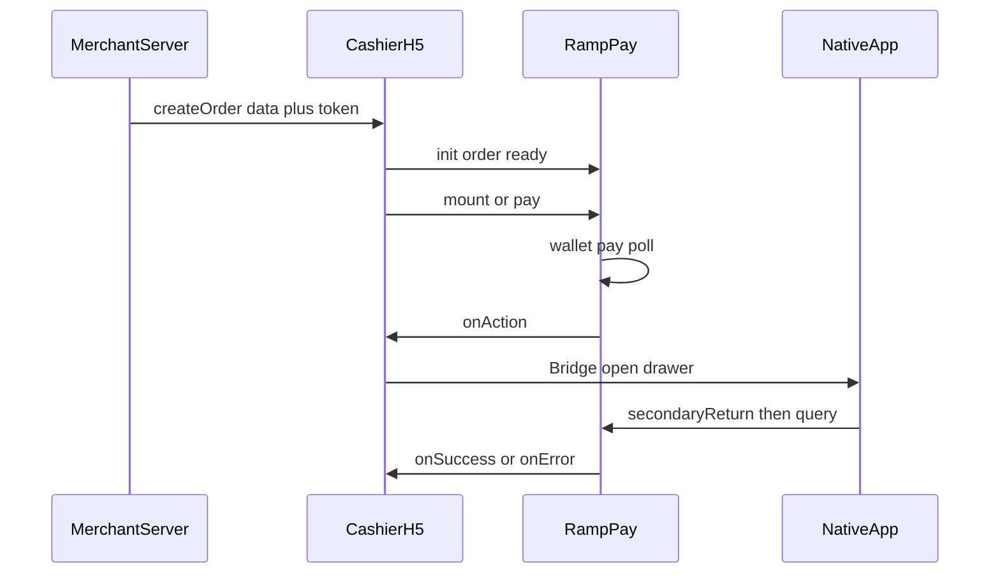

# Pay SDK 商户交付包

本目录是给商户的**最终版**接入材料：SDK 文件、接入文档、App WebView 要求、3DS 参考壳页。

## 交付清单

| 路径                                                 | 说明                                                                               |
| ---------------------------------------------------- | ---------------------------------------------------------------------------------- |
| [`CHANGELOG.md`](./CHANGELOG.md)                     | 交付版本记录（与 `RampPay.version` 一致）                                          |
| [`pay.min.js`](./pay.min.js)                         | 浏览器 / WebView 用的 SDK（IIFE，`window.RampPay`）                                |
| [`ramp-pay/v1/pay.min.js`](./ramp-pay/v1/pay.min.js) | 上传 static 用的目录布局（与官方 URL 路径一致）                                    |
| [`SDK.md`](./SDK.md)                                 | H5 / 收银台接入：init、流程、回调、清单                                            |
| [`WEBVIEW.md`](./WEBVIEW.md)                         | App 底部抽屉、Bridge 契约、关栏与催查单                                            |
| [`GOOGLE_PAY_ANDROID.md`](./GOOGLE_PAY_ANDROID.md)   | Android WebView Production：**Domain + App** 均需过审；`OR_BIBED_11` / `13` / `15` |
| [`APPLE_PAY_IOS.md`](./APPLE_PAY_IOS.md)             | iOS `WKWebView` + H5 Apple Pay：域名校验、真机 / Wallet、自检                      |
| [`SERVER.md`](./SERVER.md)                           | 商户服务端：签名创建订单、响应字段、环境域名                                       |
| [`PARAMETERS.md`](./PARAMETERS.md)                   | `RampPay.init` 参数表                                                              |
| [`html/`](./html/)                                   | Challenge / Method 参考壳页（可自托管）                                            |

将 `ramp-pay/v1/pay.min.js` 上传到 `https://static.alchemypay.org/ramp-pay/v1/pay.min.js`（`Content-Type: application/javascript`；`v1` 建议短缓存或发布时刷 CDN）。

## 角色与阅读顺序

| 角色                     | 建议阅读                                                                                                                                                                                                                            |
| ------------------------ | ----------------------------------------------------------------------------------------------------------------------------------------------------------------------------------------------------------------------------------- |
| 商户服务端               | ① [`SERVER.md`](./SERVER.md)                                                                                                                                                                                                        |
| 纯浏览器收银台 H5        | ② [`SDK.md`](./SDK.md)（含 §6.1 `actionMode: 'auto'`）→ [`PARAMETERS.md`](./PARAMETERS.md)                                                                                                                                          |
| App（Android / iOS）内嵌 | ③ [`WEBVIEW.md`](./WEBVIEW.md) + [`html/`](./html/)；Android Google Pay Production 见 [`GOOGLE_PAY_ANDROID.md`](./GOOGLE_PAY_ANDROID.md)；iOS Apple Pay 见 [`APPLE_PAY_IOS.md`](./APPLE_PAY_IOS.md)；`actionMode` 用默认 `callback` |



## 一句话流程

商户服务端签名**创建订单** → 把响应（含 `token`）交给 H5 → `RampPay.init({ order })` → `ready()` → **`mount()`（官方按钮）或自定义按钮 + `pay()`** → 用户授权钱包 → SDK 支付 / 查单 → 若有二次动作则 `onAction`（App 用 Bridge 开抽屉）→ `onSuccess` / `onError`。

## 引用 SDK

```html
<script src="https://static.alchemypay.org/ramp-pay/v1/pay.min.js"></script>
```

自托管：

```html
<script src="./pay.min.js"></script>
```

控制台可查精确版本：`RampPay.version`（当前交付见 [CHANGELOG.md](./CHANGELOG.md)）。
