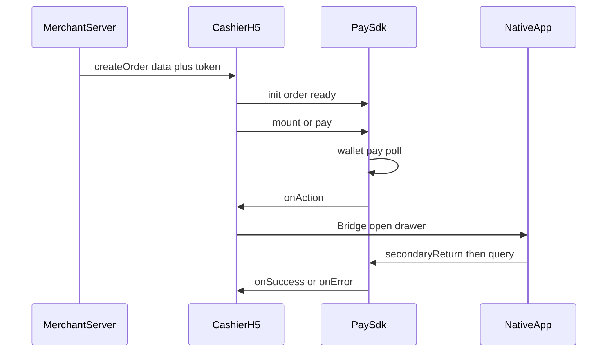

# Pay SDK 商户交付包

本目录是给商户的**最终版**接入材料：SDK 文件、接入文档、App WebView 要求、3DS 参考壳页。

## 交付清单

| 路径                                               | 说明                                                       |
| -------------------------------------------------- | ---------------------------------------------------------- |
| [`pay-sdk.js`](./pay-sdk.js)                       | 浏览器 / WebView 用的 SDK（IIFE，`window.PaySdk`）         |
| [`SDK.md`](./SDK.md)                               | H5 / 收银台接入：init、流程、回调、清单                    |
| [`WEBVIEW.md`](./WEBVIEW.md)                       | App 底部抽屉、Bridge 契约、关栏与催查单                    |
| [`GOOGLE_PAY_ANDROID.md`](./GOOGLE_PAY_ANDROID.md) | Android Production：`OR_BIBED_11` / `13` / `15` 与官方链接 |
| [`SERVER.md`](./SERVER.md)                         | 商户服务端：签名创建订单、响应字段、环境域名               |
| [`PARAMETERS.md`](./PARAMETERS.md)                 | `PaySdk.init` 参数表                                       |
| [`html/`](./html/)                                 | Challenge / Method 参考壳页（可自托管）                    |

构建时 `npm run build` 会把最新 `dist/pay-sdk.js` 同步到本目录（与 `demo/pay-sdk.js` 同源）。

## 角色与阅读顺序

| 角色                     | 建议阅读                                                                                                                                                         |
| ------------------------ | ---------------------------------------------------------------------------------------------------------------------------------------------------------------- |
| 商户服务端               | ① [`SERVER.md`](./SERVER.md)                                                                                                                                     |
| 纯浏览器收银台 H5        | ② [`SDK.md`](./SDK.md)（含 §6.1 `actionMode: 'auto'`）→ [`PARAMETERS.md`](./PARAMETERS.md)                                                                       |
| App（Android / iOS）内嵌 | ③ [`WEBVIEW.md`](./WEBVIEW.md) + [`html/`](./html/)；Google Pay Production 见 [`GOOGLE_PAY_ANDROID.md`](./GOOGLE_PAY_ANDROID.md)；`actionMode` 用默认 `callback` |



## 一句话流程

商户服务端签名**创建订单** → 把响应（含 `token`）交给 H5 → `PaySdk.init({ order })` → `ready()` → **`mount()`（官方按钮）或自定义按钮 + `pay()`** → 用户授权钱包 → SDK 支付 / 查单 → 若有二次动作则 `onAction`（App 用 Bridge 开抽屉）→ `onSuccess` / `onError`。

## 引用 SDK

```html
<script src="./pay-sdk.js"></script>
<!-- 或上传 CDN 后 -->
<script src="https://你的CDN域名/pay-sdk.js"></script>
```
