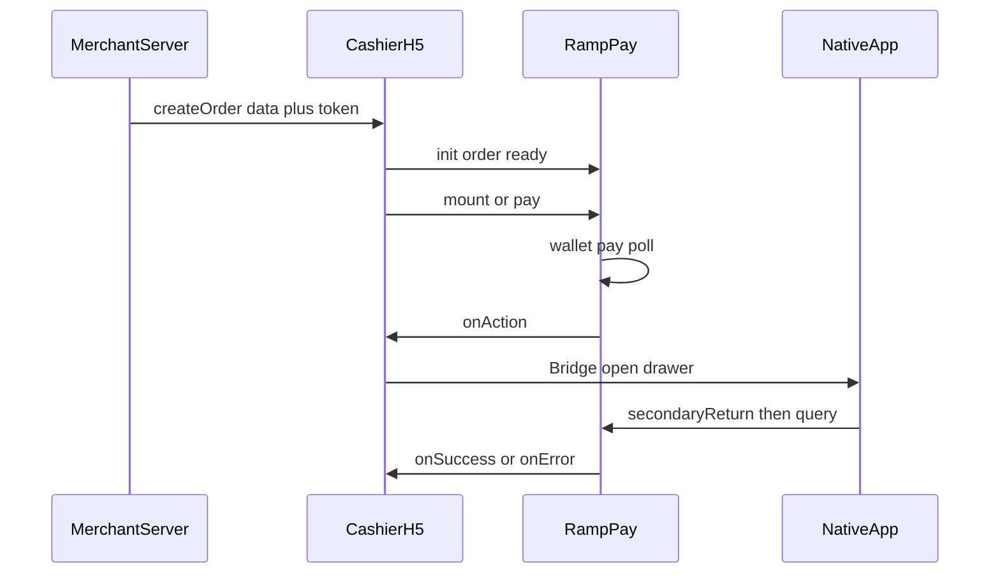

# Pay SDK 商户交付包

本目录是商户接入材料：接入文档、App WebView 要求、3DS 参考壳页。  
**SDK 脚本请使用官方 CDN 引入**（见下方「引用 SDK」），本包不含 `pay.min.js` 文件。

## 适用范围

- **支持**：浏览器 / App WebView 内嵌 H5，通过 Pay SDK 完成 **Google Pay / Apple Pay**
- **不支持**：银行卡直连、纯 Native SDK（不加载本 JS）、小程序等无法引入 CDN 脚本的场景（另有自对接方案，需单独商务沟通）

创单、签名见平台已提供的商户 API 文档；本包只说明 **如何把创单结果交给 SDK** 及收银台 / App 落地。

## 文档分工

| 文档                                                                                      | 何时阅读                                      |
| ----------------------------------------------------------------------------------------- | --------------------------------------------- |
| [SDK.md](./SDK.md)                                                                        | **主文档**：H5 接入流程、示例、回调、检查清单 |
| [PARAMETERS.md](./PARAMETERS.md)                                                          | 查 `RampPay.init` 参数表时翻阅                |
| [SERVER.md](./SERVER.md)                                                                  | 服务端：创单后把 `data` 交给 H5               |
| [WEBVIEW.md](./WEBVIEW.md)                                                                | App 内嵌：Bridge、抽屉、3DS 壳页              |
| [GOOGLE_PAY_ANDROID.md](./GOOGLE_PAY_ANDROID.md) / [APPLE_PAY_IOS.md](./APPLE_PAY_IOS.md) | 对应平台 Production / 域名校验问题            |

## 交付清单

| 路径                                               | 说明                                                                               |
| -------------------------------------------------- | ---------------------------------------------------------------------------------- |
| [`SDK.md`](./SDK.md)                               | H5 / 收银台接入：init、流程、回调、清单                                            |
| [`WEBVIEW.md`](./WEBVIEW.md)                       | App 底部抽屉、Bridge 契约、关栏与催查单                                            |
| [`GOOGLE_PAY_ANDROID.md`](./GOOGLE_PAY_ANDROID.md) | Android WebView Production：**Domain + App** 均需过审；`OR_BIBED_11` / `13` / `15` |
| [`APPLE_PAY_IOS.md`](./APPLE_PAY_IOS.md)           | iOS `WKWebView` + H5 Apple Pay：域名校验、真机 / Wallet、自检                      |
| [`SERVER.md`](./SERVER.md)                         | 商户服务端：创单后把 `data` 交给 H5（创单接口见平台已有 API 文档）                 |
| [`PARAMETERS.md`](./PARAMETERS.md)                 | `RampPay.init` 参数表（查表用）                                                    |
| [`html/`](./html/)                                 | Challenge / Method 参考壳页（可自托管）                                            |

## 角色与阅读顺序

| 角色                     | 建议阅读                                                                                                                                                                                                                   |
| ------------------------ | -------------------------------------------------------------------------------------------------------------------------------------------------------------------------------------------------------------------------- |
| 商户服务端               | ① 平台创单 API 文档 → ② [`SERVER.md`](./SERVER.md)                                                                                                                                                                         |
| 纯浏览器收银台 H5        | ③ [`SDK.md`](./SDK.md)（含 §7.1 `actionMode: 'auto'`）；查参数见 [`PARAMETERS.md`](./PARAMETERS.md)                                                                                                                        |
| App（Android / iOS）内嵌 | ④ [`SDK.md`](./SDK.md) + [`WEBVIEW.md`](./WEBVIEW.md) + [`html/`](./html/)；Android 见 [`GOOGLE_PAY_ANDROID.md`](./GOOGLE_PAY_ANDROID.md)；iOS 见 [`APPLE_PAY_IOS.md`](./APPLE_PAY_IOS.md)；`actionMode` 用默认 `callback` |



## 一句话流程

商户服务端签名**创建订单** → 把响应 `data` 交给 H5 → `RampPay.init({ order })` → `ready()` → **`mount()`（官方按钮）或自定义按钮 + `pay()`** → 用户授权钱包 → SDK 支付 / 查单 → 若有二次动作则 `onAction`（App 用 Bridge 开抽屉）→ `onSuccess` / `onError`。

## 引用 SDK

在收银台 H5 页面通过 **官方 CDN** 引入（IIFE，挂载到 `window.RampPay`）：

```html
<script src="https://static.alchemypay.org/ramp-pay/v1/pay.min.js"></script>
```

控制台可查精确版本：`RampPay.version`。

## 联调排障

向平台反馈问题时，请一并提供 **`orderNo`**、**`RampPay.version`**、**`sdk.getLastTraceId()`**（在 `onError` 或失败现场读取）。
