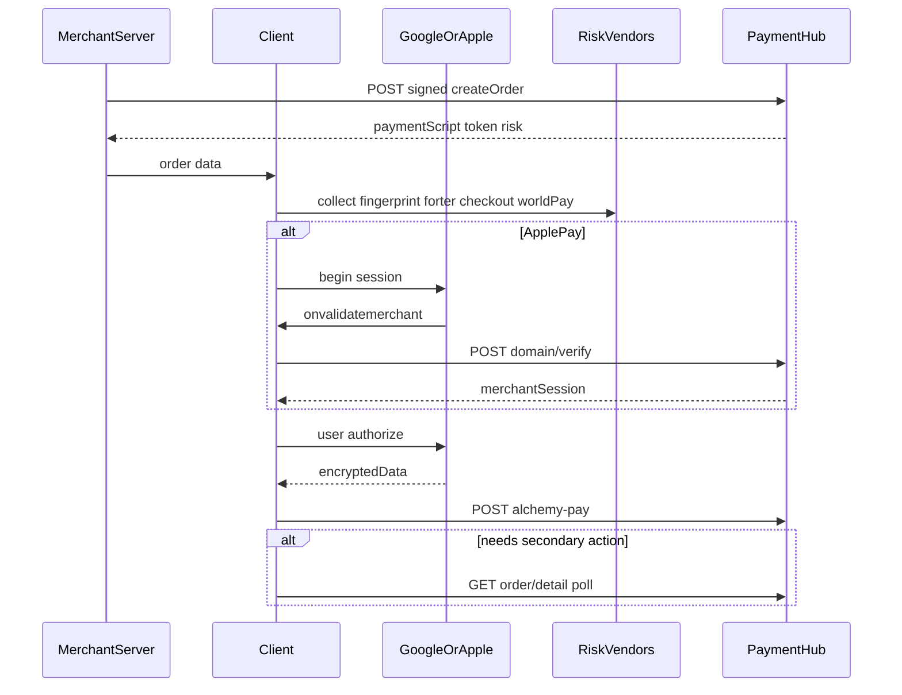

# 自唤起 Google Pay / Apple Pay 对接说明

面向**不能引入** Alchemy Pay JS SDK（`pay.min.js`）、需自行对接钱包与接口的商户。

网页 / WebView 商户请使用仓库 [`output/`](../output/) 交付包，不要用本文替代。

---

## 1. 适用场景与职责

| 步骤                                       | 谁做                                           |
| ------------------------------------------ | ---------------------------------------------- |
| 签名创建订单                               | **商户服务端**（必做）                         |
| 用 `paymentScript` 唤起官方 / 原生 GP/AP   | **商户客户端**                                 |
| Fingerprint / Forter / Checkout / WorldPay | **商户客户端**（按创单 `risk`）                |
| Apple 域名校验、支付、订单详情             | **商户客户端**（请求头带 `payment-hub-token`） |

签名规范：[API Sign](https://alchemypay.readme.io/docs/api-sign)。创建订单之后的接口**不签名**，不要把 `appSecret` 放到客户端。

### API 根域名

`https://api.alchemypay.org`

完整 URL = 根域名 + 下文路径。

### 统一响应壳

业务字段一律在 `data` 内。成功：`returnCode === '0000'`。

```json
{
  "success": true,
  "returnCode": "0000",
  "returnMsg": "SUCCESS",
  "extend": "",
  "data": {},
  "traceId": "..."
}
```

---

## 2. 主流程



---

## 3. 创建订单（服务端）

**POST** `/open/api/v4/merchant/order/create`

钱包：`payWayCode` = `701`（Google Pay）/ `501`（Apple Pay）。

### 3.1 请求常用字段

| 字段              | 必填 | 说明                         |
| ----------------- | ---- | ---------------------------- |
| `side`            | 是   | `BUY` / `SELL`               |
| `merchantOrderNo` | 是   | 商户订单号，唯一             |
| `amount`          | 是   | 如 `"10.00"`                 |
| `fiatCurrency`    | 是   | 如 `"USD"`                   |
| `cryptoCurrency`  | 是   | 如 `"USDC"`                  |
| `orderType`       | 是   | onramp `"4"` / offramp `"6"` |
| `address`         | 否*  | onramp 收款地址              |
| `network`         | 是   | 如 `"BSC"`                   |
| `payWayCode`      | 是   | `701` / `501`                |
| `redirectUrl`     | 是   | 回跳地址                     |
| `callbackUrl`     | 是   | 回调地址                     |
| `clientIp`        | 是   | 用户 IPv4                    |
| `alpha2`          | 否*  | ISO 国家码；offramp 必填     |

```json
{
  "side": "BUY",
  "merchantOrderNo": "m_ord_xxx",
  "amount": "10.00",
  "fiatCurrency": "USD",
  "alpha2": "US",
  "cryptoCurrency": "USDC",
  "orderType": "4",
  "address": "0xabc...",
  "network": "BSC",
  "payWayCode": "701",
  "redirectUrl": "https://merchant.example/success",
  "callbackUrl": "https://merchant.example/callback",
  "clientIp": "1.2.3.4"
}
```

### 3.2 响应 `data`（交给客户端）

| 字段                  | 说明                                                                                            |
| --------------------- | ----------------------------------------------------------------------------------------------- |
| `orderNo`             | 平台订单号                                                                                      |
| `paymentScript`       | 官方 GP / AP 请求对象（见 §4）                                                                  |
| `token`               | 后续请求头 `payment-hub-token`                                                                  |
| `environment`         | 可选；Google Pay `PaymentsClient.environment`，生产为 `'PRODUCTION'`（未下发时也按 PRODUCTION） |
| `method`              | 可选 `'googlePay'` \| `'applePay'`                                                              |
| `risk`                | 可选；风控开关与可覆盖配置（见 §5）                                                             |
| `validateMerchantUrl` | 仅 Apple；可选，覆盖默认域名校验 URL                                                            |

安全下发：勿把 `appSecret` 放到前端。

---

## 4. 用 `paymentScript` 自己拼装钱包

**本包不复述 Google / Apple 官方接入教程。** 请直接按官方文档实现唤起；下文只写与 Alchemy 接口相关的映射。

### 4.1 官方文档

| 场景                 | 文档                                                                                                                                                                                                        |
| -------------------- | ----------------------------------------------------------------------------------------------------------------------------------------------------------------------------------------------------------- |
| Google Pay Web       | [Tutorial](https://developers.google.com/pay/api/web/guides/tutorial)、[PaymentDataRequest](https://developers.google.com/pay/api/web/reference/request-objects#PaymentDataRequest)                         |
| Google Pay Android   | [Overview](https://developers.google.com/pay/api/android/overview)                                                                                                                                          |
| Apple Pay on the Web | [Apple Pay JS](https://developer.apple.com/documentation/applepayontheweb)、[Merchant validation](https://developer.apple.com/documentation/applepayontheweb/applepaysession/providing-merchant-validation) |
| Apple Pay iOS        | [PassKit Apple Pay](https://developer.apple.com/documentation/passkit/apple-pay)                                                                                                                            |

官方脚本（Web）：

- Google Pay：`https://pay.google.com/gp/p/js/pay.js`
- Apple Pay：`https://applepay.cdn-apple.com/jsapi/1.latest/apple-pay-sdk.js`

### 4.2 我方约定（必须遵守）

1. **`data.paymentScript` 即为官方请求对象**：Google 用作 `PaymentDataRequest`；Apple 用作 `ApplePaySession` 的 PaymentRequest。字段以创单下发为准。
2. **`data.environment`**：仅 Google Pay 建 `PaymentsClient` 时使用，生产传 `'PRODUCTION'`（未下发也按 PRODUCTION）。也可出现在 `paymentScript.environment`，语义相同。
3. **Google Pay**：若走 Web 且与我方收银台行为对齐，建议 `callbackIntents: ['PAYMENT_AUTHORIZATION']`，并在 `onPaymentAuthorized` 内完成支付接口调用后再返回成功（创单若带了其它 intents，建议覆盖为上述值）。详见官方 Payment Authorization 说明。
4. **拿到钱包结果后填支付接口**：

| 钱包       | `customParam.encryptedData`                                                |
| ---------- | -------------------------------------------------------------------------- |
| Google Pay | `paymentMethodData.tokenizationData.token`（**字符串**，不要再包一层对象） |
| Apple Pay  | `JSON.stringify(event.payment)`（整个 payment 对象）                       |

5. **账单地址**（若钱包返回）：映射到支付 body 的 `customParam` 与 `poaParams`（见 §6.2）。
6. **Apple Web 域名校验**：`onvalidatemerchant` 的 `validationURL` **原样** POST 到我方域名校验接口（§6.1）；成功时把响应 `data` **原样**交给 `completeMerchantValidation`。页面 origin 必须是已在 Apple 登记的域名。
7. **关 sheet 时机**：建议在支付接口成功后再 `completePayment` / 返回 Google Pay authorization success，避免 sheet 已关但支付失败。

参考页：[`html/google-pay.html`](./html/google-pay.html)、[`html/apple-pay.html`](./html/apple-pay.html)。

---

## 5. 风控（商户自接）

仅当创单 `risk.<vendor>.enabled === true` 时采集对应厂商；失败可传空字符串，**不阻断**支付。

**Fingerprint 不在创单 `risk` 内**：建议始终采集，经请求头 `fingerprint-id` 传递。

| 厂商          | 创单字段                                              | 送到哪里                                           | 官方文档                                                                                         |
| ------------- | ----------------------------------------------------- | -------------------------------------------------- | ------------------------------------------------------------------------------------------------ |
| Fingerprint   | 无（独立）                                            | Header `fingerprint-id`                            | [Fingerprint JS Agent](https://dev.fingerprint.com/docs/js-agent)                                |
| Forter        | `risk.forter.siteId`（可覆盖）                        | `businessParams.cookie`                            | [Forter front-end](https://docs.forter.com/front-end-integration)                                |
| Checkout Risk | `risk.checkout.publicKey` / `scriptUrl` / `integrity` | `businessParams.checkoutCookie`（deviceSessionId） | [Checkout Risk.js](https://www.checkout.com/docs/developer-resources/sdks/risk-sdks/risk-js-sdk) |
| WorldPay DDC  | `risk.worldPay.jwt` / `bin` / `actionUrl`             | 支付 body 顶层 `sessionId`                         | 用本包 [`html/worldpay-ddc.html`](./html/worldpay-ddc.html)                                      |

创单有值则覆盖 §7 默认值；无值用默认。

---

## 6. 客户端必调接口

以下 3 个接口请求头：

| Header              | 必填    | 说明                   |
| ------------------- | ------- | ---------------------- |
| `payment-hub-token` | 是      | 创建订单返回的 `token` |
| `fingerprint-id`    | 建议    | Fingerprint visitorId  |
| `Content-Type`      | POST 时 | `application/json`     |

### 6.1 Apple Pay 域名校验

**POST** `{validateMerchantUrl}`；未下发时用：

`https://api.alchemypay.org/payment-hub/domain/verify`

Apple 侧流程见官方 [Merchant validation](https://developer.apple.com/documentation/applepayontheweb/applepaysession/providing-merchant-validation)。

#### 请求

```json
{
  "orderNo": "ord_xxx",
  "validationURL": "https://apple-pay-gateway.apple.com/paymentservices/startSession"
}
```

| 字段            | 必填 | 说明                                |
| --------------- | ---- | ----------------------------------- |
| `orderNo`       | 是   | 创建订单返回                        |
| `validationURL` | 是   | Apple `onvalidatemerchant` 原样转发 |

#### 响应

`returnCode === '0000'` 时 **`data` 即为 opaque `merchantSession`**，原样：

```js
session.completeMerchantValidation(response.data)
```

示意（字段以实际响应为准）：

```json
{
  "success": true,
  "returnCode": "0000",
  "returnMsg": "SUCCESS",
  "extend": "",
  "data": {
    "epochTimestamp": 1728461305683,
    "expiresAt": 1728464905683,
    "merchantSessionIdentifier": "...",
    "nonce": "...",
    "merchantIdentifier": "...",
    "domainName": "ramp.alchemypay.org",
    "displayName": "rampservice",
    "signature": "..."
  },
  "traceId": "..."
}
```

### 6.2 支付

**POST** `/payment-hub/alchemy-pay`

#### 请求字段

| 字段                            | 必填 | 说明                                                                                             |
| ------------------------------- | ---- | ------------------------------------------------------------------------------------------------ |
| `orderNo`                       | 是   | 创建订单返回                                                                                     |
| `customParam.encryptedData`     | 是   | GP token 串 / AP `JSON.stringify(payment)`                                                       |
| `customParam.addressLine1` 等   | 否   | 账单：`addressLine1`、`addressLine2`、`city`、`state`、`zip`、`country`、`firstName`、`lastName` |
| `businessParams.cookie`         | 否   | Forter token                                                                                     |
| `businessParams.checkoutCookie` | 否   | Checkout deviceSessionId                                                                         |
| `businessParams.dob`            | 否   | 可选扩展                                                                                         |
| `sessionId`                     | 否   | WorldPay DDC SessionId                                                                           |
| `poaParams`                     | 否   | 有账单时：`address`←`addressLine1`，`postcode`←`zip`，以及 `city` / `state` / `country`          |

#### 最小请求（Google Pay）

```json
{
  "orderNo": "ord_xxx",
  "customParam": {
    "encryptedData": "...google pay tokenizationData.token string..."
  }
}
```

#### 完整请求示意

```json
{
  "orderNo": "ord_xxx",
  "customParam": {
    "encryptedData": "...",
    "addressLine1": "1 Main St",
    "addressLine2": "",
    "city": "San Francisco",
    "state": "CA",
    "zip": "94105",
    "country": "US",
    "firstName": "Jane",
    "lastName": "Doe"
  },
  "businessParams": {
    "cookie": "forter-token",
    "checkoutCookie": "dsid_..."
  },
  "sessionId": "worldpay-session-id",
  "poaParams": {
    "address": "1 Main St",
    "city": "San Francisco",
    "state": "CA",
    "postcode": "94105",
    "country": "US"
  }
}
```

#### 响应 `data` 分支

先判断外层 `returnCode === '0000'`，再看 `data`：

| 条件                                 | 客户端动作              | 是否轮询订单详情 |
| ------------------------------------ | ----------------------- | ---------------- |
| `returnCode !== '0000'`              | 失败，展示 `returnMsg`  | **否**           |
| `data` 无二次动作字段                | 支付成功结束            | **否**           |
| 有 `webUrl`                          | 打开该 URL              | **是**           |
| 有 `MD` + `JWT` + `action`           | 打开 3DS Challenge 壳页 | **是**           |
| 有 `threeDSMethodData` + `methodUrl` | 打开 3DS Method 壳页    | **是**           |

```json
{}
```

```json
{ "webUrl": "https://psp.example/checkout/xxx" }
```

```json
{
  "MD": "...",
  "JWT": "...",
  "action": "https://acs.example/challenge"
}
```

```json
{
  "threeDSMethodData": "...",
  "methodUrl": "https://psp.example/3ds-method"
}
```

壳页用法见 [`html/README.md`](./html/README.md)。

### 6.3 订单详情（轮询）

**GET** `/payment-hub/order/detail`

无 query / body；订单由请求头 `payment-hub-token` 标识。

建议间隔 **2s**，超时 **5 分钟**（与 SDK 默认一致，可按业务调整）。

#### 响应 `data` 关键字段

| 字段            | 说明                                 |
| --------------- | ------------------------------------ |
| `orderNo`       | 订单号                               |
| `orderState`    | 数字状态；部分环境兼容 `orderStatus` |
| `s3dsUrl`       | 有值则打开继续验证                   |
| `s3dsComplete`  | `true` 时停止轮询                    |
| `failureReason` | 失败原因（可选）                     |
| `redirectUrl`   | 商户回跳（可选）                     |

#### `orderState` 映射（on-ramp）

| 值         | 含义         |
| ---------- | ------------ |
| `0`        | PAY_FAIL     |
| `1`        | PENDING      |
| `2`        | PAY_SUCCESS  |
| `3` / `4`  | TRANSFER     |
| `5`        | FINISHED     |
| `6`        | CANCEL       |
| `7`        | PAY_FAIL     |
| `8`        | RISK_CONTROL |
| `9` / `10` | REFUNDED     |
| `11`       | PAY_FAIL     |

#### 轮询建议

1. 有效 `s3dsUrl` → 打开该地址（可继续轮询或按产品停轮询）
2. `orderState === 1` 且未 `s3dsComplete` → 继续
3. `s3dsComplete === true` 或 `orderState !== 1` → 停止
4. 终态：`{0,6,7,8,9,10,11}` → 失败；`{2,5}` → 成功

```json
{
  "success": true,
  "returnCode": "0000",
  "returnMsg": "SUCCESS",
  "extend": "",
  "data": {
    "orderNo": "ord_xxx",
    "orderState": 1,
    "s3dsComplete": false
  },
  "traceId": "..."
}
```

---

## 7. 我方默认值（接口未下发时自行补齐）

下列值**不一定**出现在创单响应中；自对接时若字段缺失，可按此补齐（与现有 JS SDK 行为对齐）。**如何调用 GP/AP API 仍以官方文档为准。**

### 7.1 Google Pay 兜底

| 项                                     | 默认                                                 |
| -------------------------------------- | ---------------------------------------------------- |
| `callbackIntents`                      | `['PAYMENT_AUTHORIZATION']`                          |
| `PaymentsClient.environment`           | `PRODUCTION`                                         |
| 缺省 auth / networks（仅极端缺字段时） | `PAN_ONLY` + `CRYPTOGRAM_3DS`；`MASTERCARD` + `VISA` |
| `apiVersion` / `apiVersionMinor`       | `2` / `0`                                            |
| `totalPriceStatus`                     | `FINAL`                                              |
| `totalPriceLabel`（兜底）              | `Total`                                              |

> 生产环境的 `merchantId` / `merchantName` / `gateway` / `gatewayMerchantId` 以创单 `paymentScript` 下发为准，勿使用测试商户占位值。

### 7.2 Apple Pay 兜底

| 项                                      | 默认                                             |
| --------------------------------------- | ------------------------------------------------ |
| `ApplePaySession` version               | `3`                                              |
| `merchantCapabilities`                  | `supports3DS`, `supportsCredit`, `supportsDebit` |
| `supportedNetworks`                     | `masterCard`, `visa`                             |
| `total.label`                           | `ALCHEMY GPS EUROPE UAB`                         |
| `total.type`                            | `final`                                          |
| 需账单时 `requiredBillingContactFields` | `name`, `postalAddress`, `phone`, `email`        |

### 7.3 风控默认（生产）

| 厂商                   | 默认                                                                      |
| ---------------------- | ------------------------------------------------------------------------- |
| Fingerprint `apiKey`   | `BhQq2qOOYR3oeMTEKIc2`                                                    |
| Fingerprint loader     | `https://fp.alchemypay.org/web/v3/BhQq2qOOYR3oeMTEKIc2/loader_v3.9.9.js`  |
| Fingerprint endpoint   | `https://fp.alchemypay.org`                                               |
| Forter `siteId`        | `b132efccafac`                                                            |
| Checkout `publicKey`   | `pk_aldlsnx6lhkjggag4qe2nff4c4h`                                          |
| Checkout script        | `https://risk.checkout.com/cdn/risk/3.3.1/risk.js`                        |
| Checkout SRI           | `sha384-bdtH448zhkYQQTsR0FB6/ITKVZ1zdSi5Dv5NN5AILI1ZBIMJFsqKs8Upm6bWD+DL` |
| WorldPay `actionUrl`   | `https://centinelapi.cardinalcommerce.com/V1/Cruise/Collect`              |
| WorldPay `jwt` / `bin` | 无默认；`jwt` 须由创单下发才可采集                                        |

### 7.4 其它

| 项              | 默认                         |
| --------------- | ---------------------------- |
| `environment`   | `PRODUCTION`                 |
| 轮询间隔 / 超时 | `2000` ms / `300000` ms      |
| 域名校验路径    | `/payment-hub/domain/verify` |

---

## 8. 检查清单

- [ ] 服务端签名创建订单，响应含 `orderNo` / `paymentScript` / `token`
- [ ] Google Pay：`PaymentsClient.environment` 为 `PRODUCTION`（或未下发时按 PRODUCTION）
- [ ] 客户端按官方文档唤起 GP/AP；`encryptedData` 映射正确
- [ ] Apple：域名校验 + `completeMerchantValidation`；页面域已登记
- [ ] 按 `risk.*.enabled` 自接风控；Header 带 `payment-hub-token`（及建议的 `fingerprint-id`）
- [ ] 支付二次动作使用本包 3DS 壳页或等价实现，并按规则轮询订单详情
- [ ] 未把 `appSecret` 放到客户端
